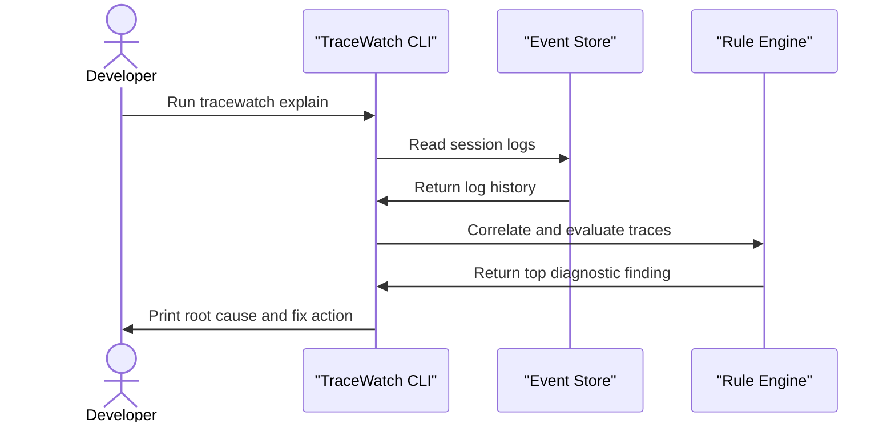

# TraceWatch

TraceWatch helps developers quickly diagnose local application crashes by connecting the dots across multiple services. It watches local service outputs in real time, correlates fragmented logs into logical traces, and automatically pinpoints exactly what broke and how to fix it. No complex setup is required, just straightforward incident intelligence that works out of the box.

## System Architecture


## Installation

Clone the repository and install the required dependencies:

```bash
git clone https://github.com/olusanyaemmanuelpg-sudo/tracewatch.git
cd tracewatch
npm install
```

To make the tool available globally on your machine, link the package:

```bash
npm link
```

## Usage

TraceWatch operates through a simple command-line interface. 

First, initialize the workspace in your project directory. This scans your local files and generates a configuration profile:

```bash
tracewatch init
```

Next, start the configured services. Adding the web flag will launch the live operations dashboard alongside the terminal output:

```bash
tracewatch start --web
```

If an error occurs, you can ask the tool to explain the latest failure. TraceWatch will sweep the log sequence and determine the root cause:

```bash
tracewatch explain
```

To export a sanitized, credential-free diagnostic report to a markdown file, run the export command:

```bash
tracewatch export --out diagnosis.md
```

## Features

* **Automatic Stack Discovery**: Scans the project directory and detects Node.js or Python frameworks to build a configuration profile automatically.
* **Live Operations Dashboard**: Streams structured logs to a browser UI while highlighting critical errors and correlating cross-service events.
* **Redacted Reporting**: Strips out credential strings, access tokens, and passwords before exporting diagnostic markdown reports.
* **Root Cause Analysis**: Sweeps over trace timelines to match error signatures against known failures like exhausted connection pools or missing environment variables.



## Technologies Used

| Category | Technology |
| :--- | :--- |
| Runtime | Node.js |
| Terminal Output | Picocolors |
| Dashboard UI | HTML5, CSS3, Vanilla JavaScript |
| Data Storage | JSON-Lines |

## API Documentation

When the web dashboard is running, TraceWatch exposes a lightweight local HTTP server with the following endpoints.

#### GET /api/logs/stream
**Description**: Opens a Server-Sent Events connection that streams live log data as it is captured from the running services.

**Request**:
No body required.

**Response**:
The endpoint returns a continuous text stream formatted as SSE.
```text
data: {"id":"evt_123","timestamp":"2026-09-21T22:41:04.413Z","service":"api","level":"info","message":"validating payload","requestId":null}

```

**Errors**:
* 404: Endpoint not found if requested with unsupported methods.

#### GET /api/explain
**Description**: Triggers an immediate analysis over the current session buffer and returns the highest confidence root cause finding.

**Request**:
No body required.

**Response**:
```json
{
  "found": true,
  "finding": {
    "rule": "pool-exhausted",
    "cause": "demo-app could not acquire a database connection as the database pool is completely exhausted.",
    "confidence": 0.8,
    "evidence": [
      {
        "id": "evt_456",
        "timestamp": "2026-09-21T22:41:04.514Z",
        "service": "db",
        "level": "fatal",
        "message": "FATAL: sorry, too many clients already",
        "requestId": null
      }
    ],
    "fix": "Increase the pool max size parameter in your database configuration file."
  }
}
```

**Errors**:
* 200: Returns `{"found": false}` if no rule violations are detected.

## Contributing

Contributions are welcome. Please open an issue to discuss proposed changes before submitting a pull request. Ensure that any new rule additions include appropriate regex matching logic and test coverage.

## Author Info

* LinkedIn: https://linkedin.com/in/olusanya-emmanuel-21546536a

---

[](https://nodejs.org/)
[](https://developer.mozilla.org/en-US/docs/Web/JavaScript)

[](https://dokugen.samueltuoyo.com)